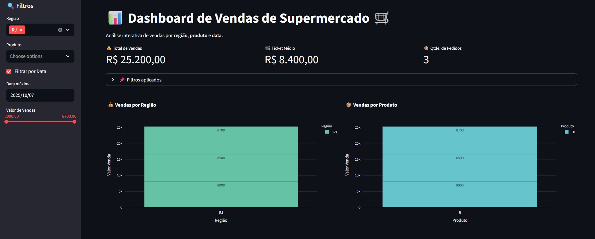

# 📊 Dashboard de Vendas de Supermercado 🛒

---

## 📋 Descrição do Projeto

Este projeto é um dashboard interativo desenvolvido em Python com Streamlit e Plotly, que permite a visualização e análise dos dados de vendas de um supermercado. O dashboard possibilita o filtro por região, produto, data e intervalo de valor de vendas, facilitando a tomada de decisões com base em dados reais.

---

## 🚀 Funcionalidades

- Filtro por Região, Produto e Data (opcional).
- Seleção do intervalo de Valor de Vendas via slider.
- Visualização de KPIs importantes:
  - Total de Vendas
  - Ticket Médio
  - Quantidade de Pedidos
- Gráficos interativos:
  - Vendas por Região (barras)
  - Vendas por Produto (barras)
  - Evolução das Vendas ao longo do tempo (linha)
- Layout responsivo com colunas para melhor visualização.
- Rodapé com informações do desenvolvedor.

---

## 🛠️ Tecnologias e Bibliotecas Usadas

- Python
- Streamlit - para criação da interface web interativa
- Pandas - para manipulação dos dados
- Plotly Express - para criação dos gráficos interativos
- Openpyxl - para leitura de arquivos Excel (.xlsx)

---

## 📂 Estrutura dos Dados

O arquivo Excel (`vendas.xlsx`) deve conter as seguintes colunas obrigatórias:

| Coluna       | Descrição                             |
|--------------|-------------------------------------|
| **Data**     | Data da venda (formato data)        |
| **Região**   | Região onde a venda foi realizada    |
| **Produto**  | Nome do produto vendido              |
| **Valor Venda** | Valor monetário total da venda     |

---

## 📖 Legenda de Termos e Conceitos Usados

| Termo              | Explicação Simplificada                                    |
|--------------------|-----------------------------------------------------------|
| **Variável**        | Uma "caixinha" que guarda informações para usar no código |
| **DataFrame**       | Tabela de dados em formato de linhas e colunas (Pandas)   |
| **Filtro**          | Processo de selecionar só os dados que interessam          |
| **Slider**          | Controle deslizante para escolher um intervalo numérico    |
| **KPIs**            | Indicadores chave (ex: total de vendas, ticket médio)      |
| **Gráfico de barras** | Visualiza dados com barras (comparação entre categorias)  |
| **Gráfico de linha** | Mostra evolução dos dado

Execute o dashboard com:

bash
Copiar
Editar
streamlit run main.py
O navegador abrirá automaticamente a interface do dashboard.

📞 Contato
Desenvolvido por Tatiana Kami
GitHub: github.com/Tatianakami

yaml
Copiar
Editar

